# Advanced Game Programming 2016-17 - Assignment 2
# Abdullah Bin Abdullah

## Team Members
**MA:**   
Pablo Larenas Henríquez  
HungLi (Leo Cho)  
Faris Omar  

**MSc:**  
Nikita Veselov  
Abdullah bin Abdullah  
Matthew Duddington  
Witek Galowski {towards the end of the project)

## Introduction

The Feeble Path is a Cooperative Dungeon Crawler where the players must save as many feebles as they can from the Evil Mage that held them hostage. This report details the development of "The Feeble Path".

## Design
The team began the project with intensive design meetings working around the constraints set by the course's modules and lessons learnt from design lectures. Preliminary ideas were a stealth game where one player is the assassin and the other is in charge of securing the target, an endless runner style game where two fish are chased by a bigger fish aiming to eat them and an obstacle game where each player adds a challenge to an obstacle course for the other to complete. The team voted on developing the obstacle game as a good direction to start.

Early on during the process Nikita joined our team and was able to be integrated into the design meetings without too much trouble. One of the meetings I didn't attend developed the game towards something similar to a dungeon crawler and the main focus is on escorting "Feebles" to safety. This was done in consideration to simplifying the design and meeting requirements of the connected modules. All of the meetings were done in person and with extensive use of the whiteboard. When the project started to gear towards production, online forms of communications were used such as Facebook Messenger and Google Hangouts. 

Any ideas that were put on the whiteboard or ideas that the team wishes to contribute are put onto the Trello page for the team.
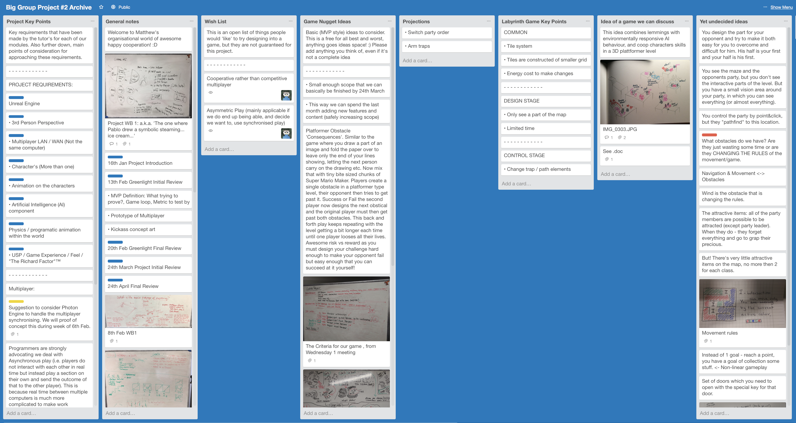  
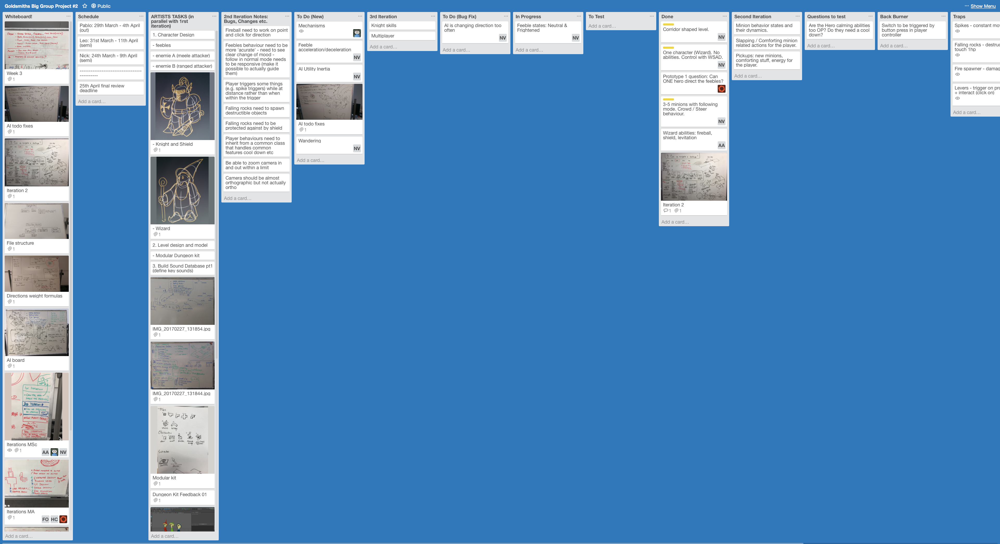

During the production phase the team used google spreadsheets to avoid the clutter that was on the Trello page which kept the important things each person needs to do in view.
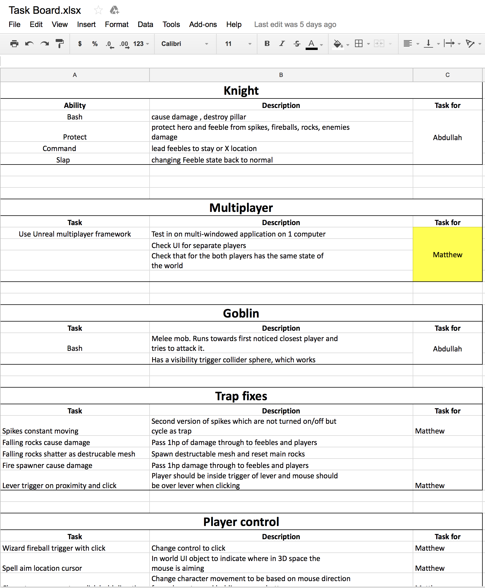  
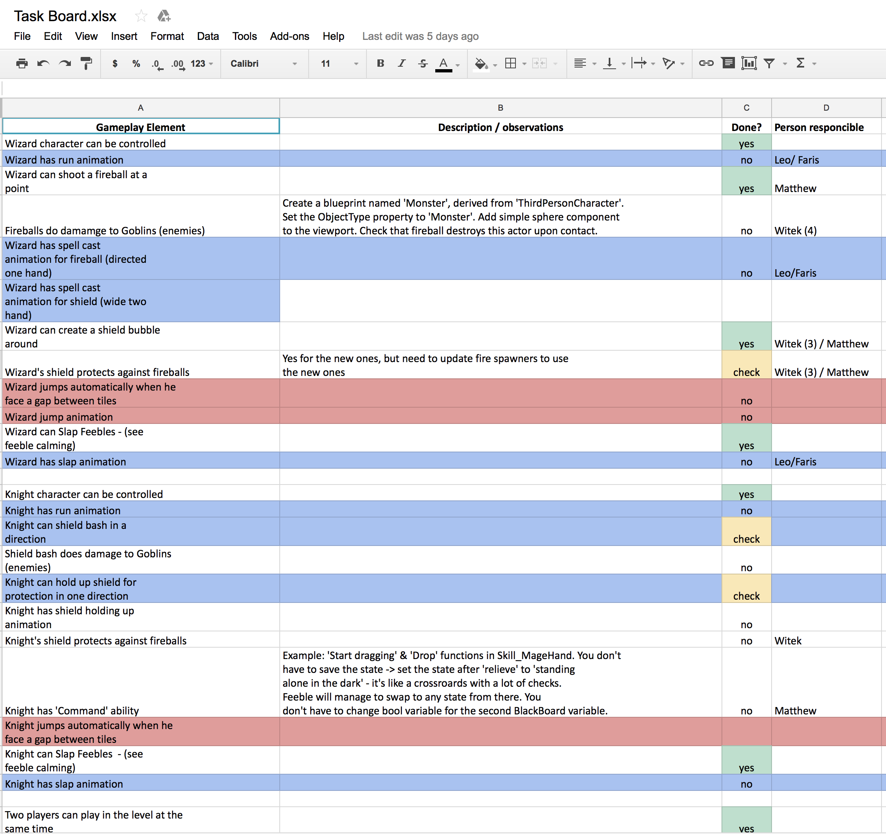  
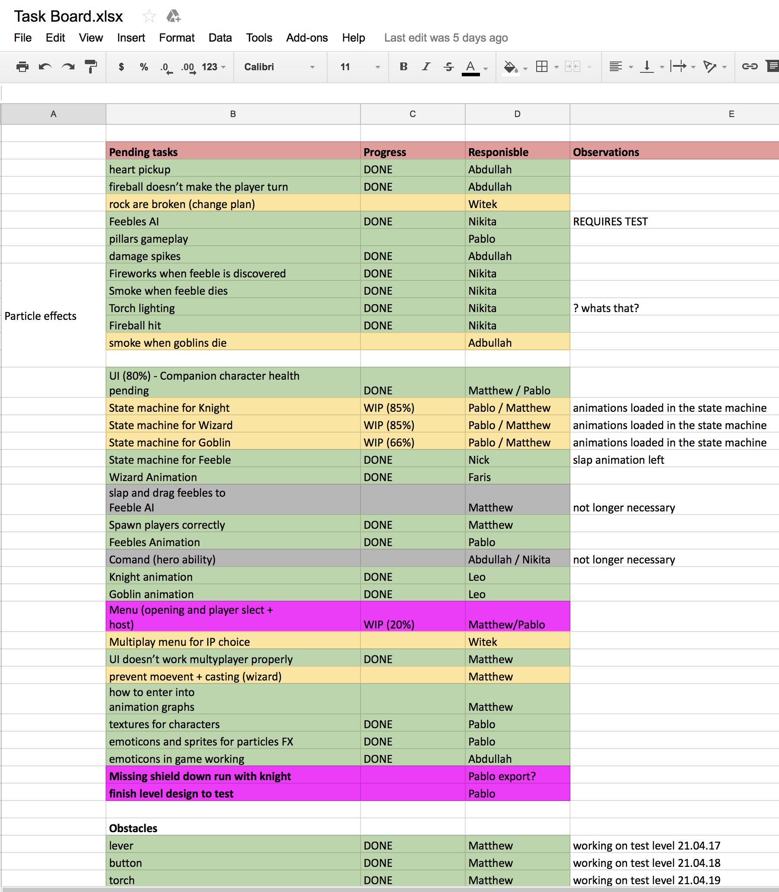  

## Production
When it came down to production, I was working with Matthew on developing the Wizard skills and traps for the game. I worked on the Mage shield and some early versions of the traps. After some time, Nikita refactored the skills system so that all the skills inherit from a base class. This class would handle the activations and cooldowns of each of the skills while custom elements are done in their respective classes.

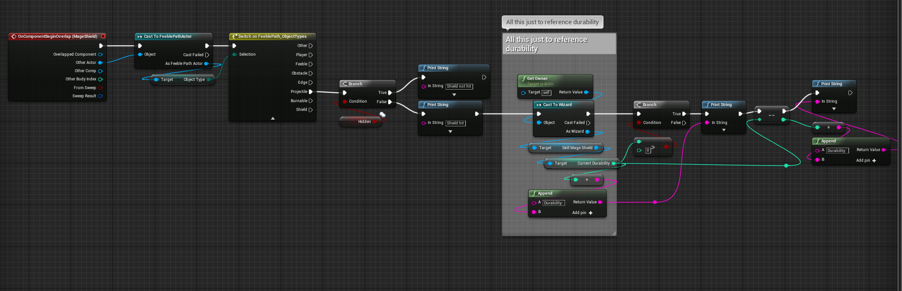

The MageShield functionality was initially stored in the MageShield object itself. The actor components would only have the job of calling the MageShield object when it was needed.

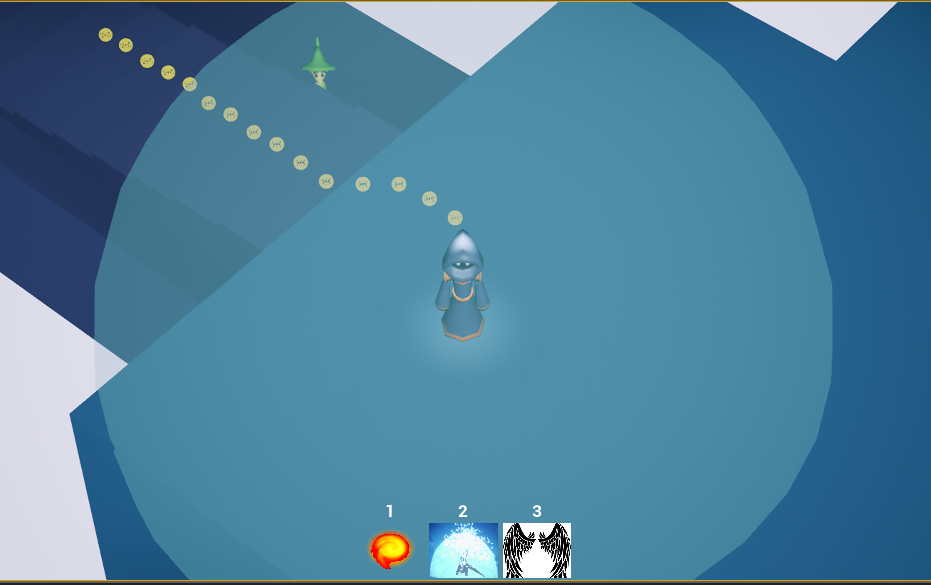

After developing this version of the MageShield, I moved on to developing the early versions of the Knight skills. I focussed mainly on the Knight Shield Bash skill and the Knight Protect skill. The Knight command skill would require modifying a Work-in-Progress Feeble AI system that Nikita was developing so I left this skill to be dealt with later. 

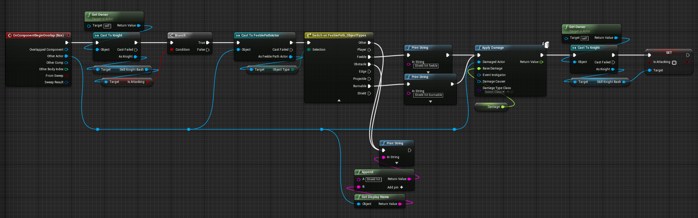

Just like the MageShield, the KnightShield's blueprint is actually stored in the Knight's shield object. A bool is used to determine whether the shield causes damage or not and in either case the shield protects the knight from damage.

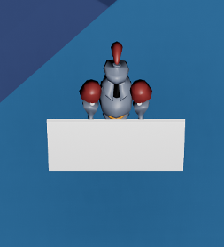

At this point when everything in the project were just prototypes, there were a lot of functionality that was haphazardly put together. Although the team checklist on Google Sheets was helpful in working towards a result, I needed to keep a personal issue tracker that keeps track of the little things that make up the whole.

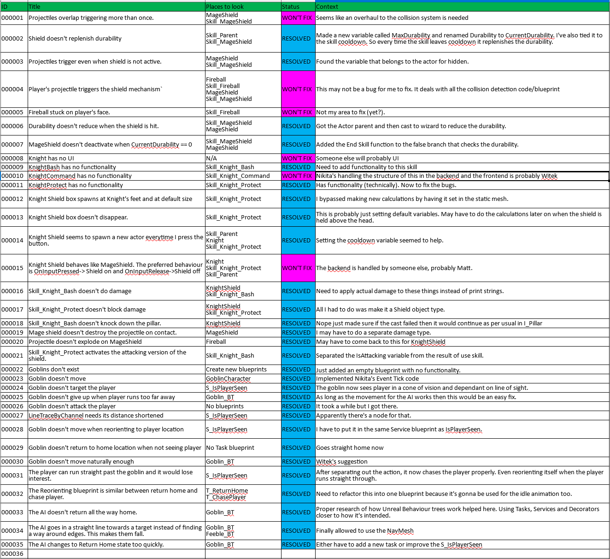

The spreadsheet was done in a way that helps not only what issues I needed to solve but the decisions I took with each one. I stopped updating this spreadsheet after a certain point in the project because any issues that popped up are fixed and commited immediately.

From here I started working on the enemy Goblin. At first I tried to emulate Nikita's Feeble AI, which doesn't use Unreal's NavMesh feature, in order to keep the design of the blueprints uniform but it proved too confusing and after discussing with the rest of the team, it was decided that the enemies can use the NavMesh feature since they don't need to fall off the edge of the map like the feebles do. The specifics of the Goblin's behaviour tree is detailed in the AI Module Report. It was at this time that Witek provided help with the project as Matthew transitions the game architecture to a multiplayer-centric one. At around about the same time, this was when Nikita was accepted into 22Cans. 

The team was uncertain at the state of the Feeble AI that Nikita left behind so it was decided that I would create a backup Feeble AI in case Nikita wouldn't be able to fix the bugs in his Feebles. The decision was made because we felt that it would take far more time to try and understand the blueprints left behind by Nikita than to make one using NavMeshes. This would reduce the amount of work in designing the Feeble's movements and we would have a simple AI should we ever need it. I named these NavMesh Feebles "Ables" to avoid confusion in the file structure.

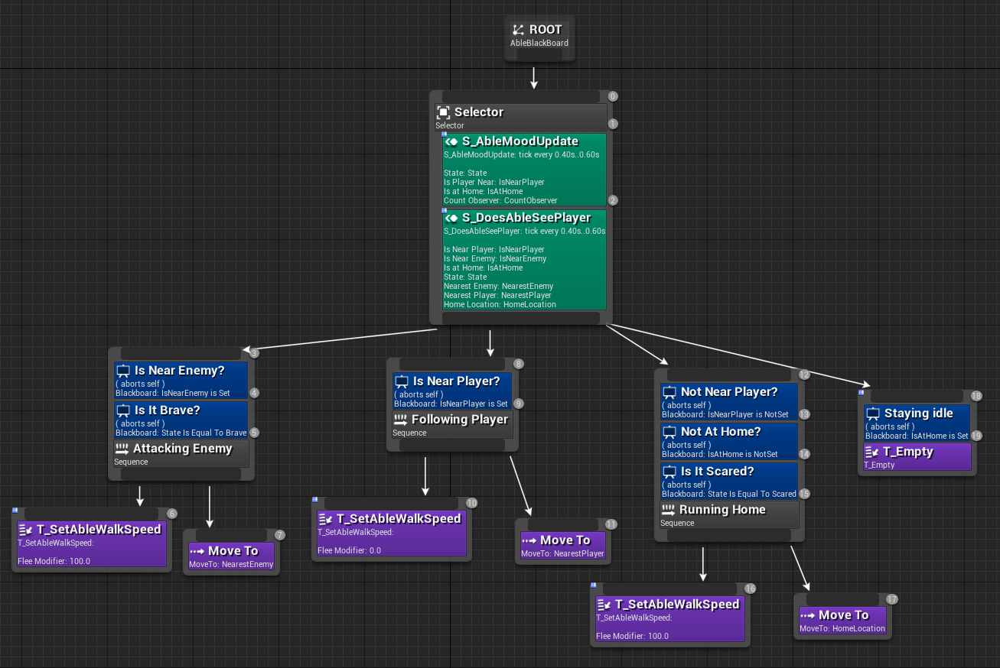

A lot of the functionality was copied over from the Goblin AI so it shares the same problems with multiple different targets at this point in time. This was because the player is hard-coded into its calculations when doing sight checks. I solved this with the AIPerception component provided by Unreal but only used it to collect the array of nearby actors and calculating the closest target. I would like to integrate this component more into the sight checks but I decided to drop this feature because I wanted the designers to be able to modify the values used in the behaviour trees without going into the behaviour trees themselves.

Until it was decided that we would go ahead with the feebles, the Ables were able to do the following tasks:
  * Follow the player when in Normal state or in Brave State when no enemy is near.
  * Charge at the enemy when it's in the Brave state (Does no damage by design)
  * Return home when scared
  * Mood worsens as it stays away from home and away from player
  * Mood becomes better if the Able is near the player
  * Able at Home location resets the mood counter

The only things missing from the Able AI were the interactions with the player. This includes the slaps, the Knight's command skill and the Wizard's MageHand skill. While this AI was scrapped in the end I feel it gives a nice alternative view of how the Feebles would've been designed with the NavMesh feature in mind.

Nearing the end of development I focussed more on bugfixes. Things such as having the Wizard face the direction the fireball is cast, making sure health pick ups are functional and constraining the Wizard's movement when a skill is cast. This is to help lighten the load on Matthew as he works on making the architecture for multiplayer. The most notable things I did at this point was to add the initial functionality of the emoticons to the feebles and linked the animation graph for the Goblin. 

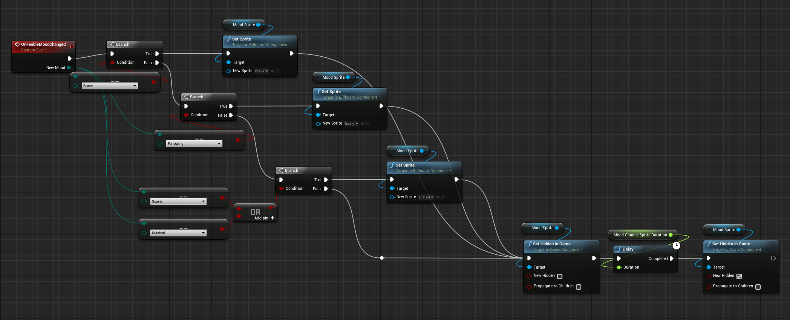

The functionality for the emoticons was pretty simple. I attached a billboard to the feeble character and depending on the Feeble's state, I set the relevant sprite for the billboard. The billboard will only show up for a certain duration when the Feeble's mood has changed. Otherwise it will remain invisible.

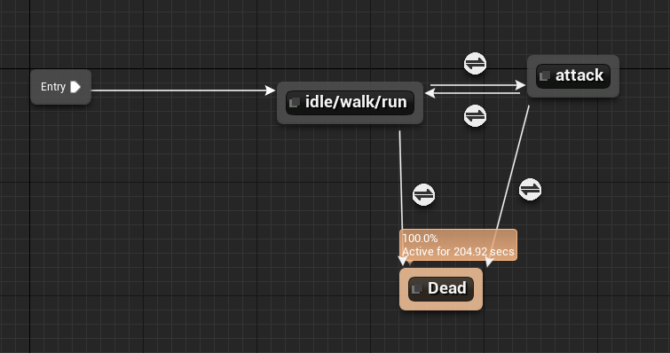

With the help of Leyla, who explained the interface regarding the animations and helped explain the concept of Animation Blends, I was able to link the animation states for the Goblin that was initially set up by Matthew.
